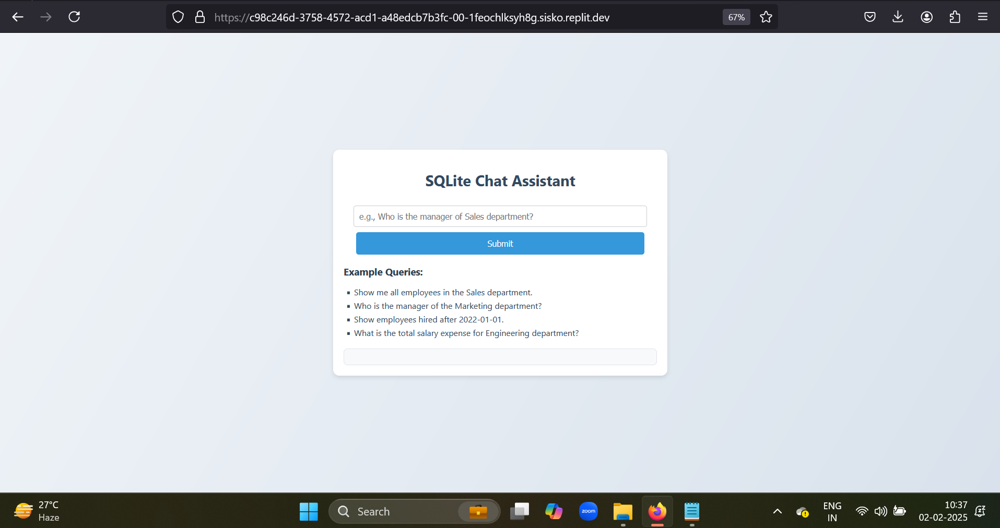

# 🚀 **SQLite Chat Assistant**

A **FastAPI-based** application that interacts with an **SQLite database** to provide answers to employee- and department-related queries. This project demonstrates the ability to design, implement, and deploy a chat assistant with a clean and dynamic user interface.

---

## 🎯 **Features**
✅ Query employee and department details using natural language.  
✅ Supports **SQL-powered** dynamic responses.  
✅ Provides a **user-friendly web interface** for submitting queries.  
✅ Preloaded **SQLite database** with sample data.  

---

## 🌐 **Live Demo**
[]

---

## 📂 **Project Structure**

```plaintext
chat_assistant_SQLite/
├── 📂 Query_Results_Screenshots/   # Contains screenshots of query results
├── 📄 README.md                    # Project description and setup instructions
├── 🖼️ UI_chat_assistant.png        # Screenshot of the UI for reference
├── 📂 templates/                   # Directory for HTML templates
│   └── 📄 index.html               # HTML file for the user interface
├── 🗄️ chat_assistant.db            # SQLite database file with preloaded data
├── 📜 index.html                   # HTML template for the chat interface
├── 🐍 main.py                      # Main FastAPI application file
├── ⚙️ replit                        # Replit configuration file
├── 📜 requirements.txt             # Python dependencies required for the project
├── 🛠️ setup_db.py                  # Script to set up and populate the SQLite database
```

---

## 🛠️ **Setup Instructions**

### 🔹 **1. Clone the Repository**
```bash
git clone https://github.com/PranitAmbulkar/chat_assistant_SQLite.git
cd chat_assistant_SQLite
```

### 🔹 **2. Install Dependencies**
Make sure you have **Python 3.10+** installed. Install the required Python packages:
```bash
pip install -r requirements.txt
```

### 🔹 **3. Set Up the Database**
Run the `setup_db.py` file to create and populate the SQLite database:
```bash
python setup_db.py
```

### 🔹 **4. Run the Application**
Start the FastAPI server:
```bash
uvicorn main:app --reload
```

## 💡 **Example Queries**
🔹 *Show me all employees in the Sales department.*  
🔹 *Who is the manager of the Marketing department?*  
🔹 *Show employees hired after 2022-01-01.*  
🔹 *What is the total salary expense for Engineering?*  

---

## ⚠️ **Known Limitations**
🚧 **SQL injection prevention** is handled minimally.  
🚧 **Error handling** for database connection issues can be improved.  

---

## 📸 **Screenshots**
### 🖼️ **1. User Interface**


### 📊 **2. Example Query Results**
Check the **`Query_Results_Screenshots/`** folder for more examples.

---

## 🌟 **Connect & Contribute**
💻 Contributions are welcome! Feel free to fork the repository and submit pull requests. If you have any suggestions or issues, open an **issue** in the repo.  

📧 **Contact:** [Pranit Ambulkar](https://github.com/PranitAmbulkar)  

🔥 **Star this repository if you found it helpful!** ⭐

